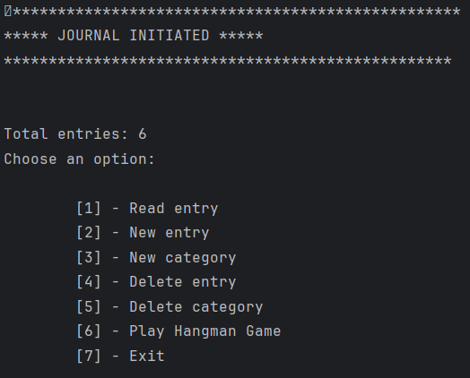
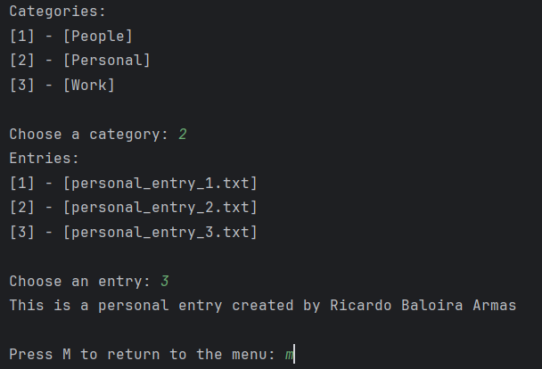
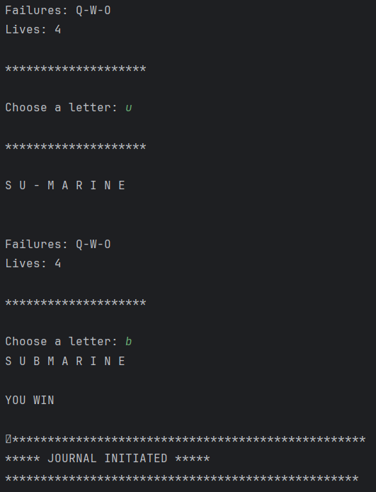
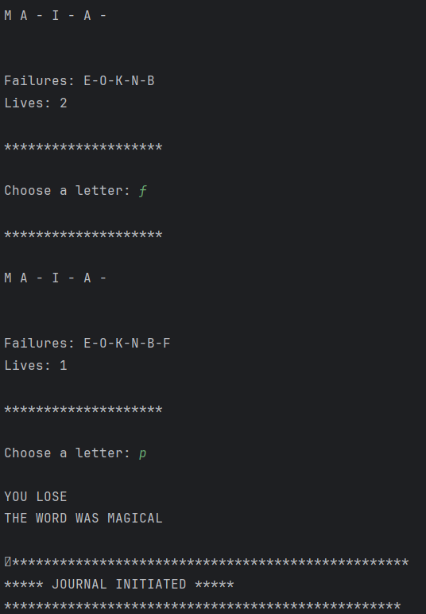

# Interactive Journal
<b>Interactive Journal</b> created with <b>Python</b>. It includes an app that allows the user to play a game of <b>Hangman</b>. 
 
 

| [📖 Features](#features) | [:camera: Screenshots](#screenshots) | [🔖 License](#license) |
|  -------- | ----------- | ----------- |

 

## Features

* **Write journal entries:** Create and delete entries at will.
 
 
* **Easy access:** Stored in different folders based on their category, you can quickly select what entry from which category you want to read.
 

* **Organize your notes:** Create and delete categories that will be used to organize entries in separate folders.
 

* **Hangman Game:** You have 7 tries to guess a word randomly selected. The game displays clues to help you, so proceed with caution.
 

 

## Screenshots

## License

This project is licensed under the [MIT License](LICENSE.txt).
